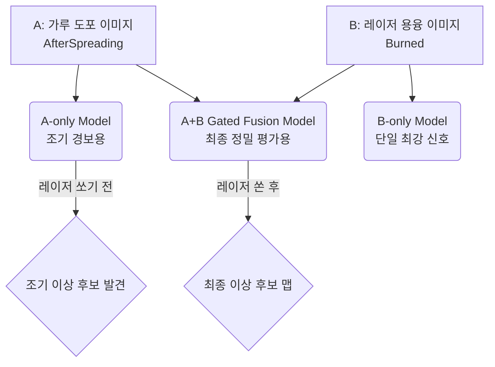
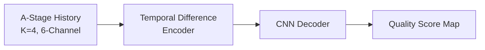
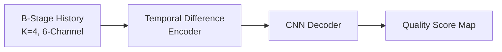
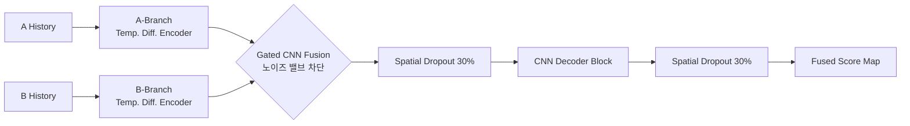

# AMMT 공정 이상 탐지 모델 아키텍처

AMMT 프로젝트에서는 용도와 시점에 따라 3가지의 주요 딥러닝 모델 아키텍처를 진화시켜 왔습니다. 각 모델의 목적과 내부 구조를 아래에 시각화하여 설명합니다.

---

## 1. 프로젝트 전체 구조 (Overall Pipeline)

전체 파이프라인은 시점에 따라 **조기 경보(Early Warning)**와 **사후 종합 평가(Post-Laser Evaluation)**로 나뉩니다.

---

## 2. 개별 모델 아키텍처 상세

### ① A-only Temporal Difference Model
* **목적:** 레이저를 쏘기 전, 가루(Powder)가 덮인 상태만 보고 이상을 예측하는 '조기 경보(Early Warning)' 모델입니다.
* **구조적 특징:** 가루 표면은 극적인 변화가 없기 때문에, 이전 레이어와 현재 레이어의 미세한 '차이(Difference)'에만 집중하도록 시계열 차분 인코더를 사용합니다.

### ② B-only Temporal Difference Model
* **목적:** 레이저를 쏜 직후의 쇳물(Melt pool)과 스패터(Spatter) 열화상을 분석하는 모델입니다.
* **구조적 특징:** 결함에 대한 가장 강력하고 직접적인 신호(다크 스팟 등)를 담고 있으며, 단일 모델 중 가장 높은 정확도(Test Loss 0.0546)를 기록한 베이스라인입니다. A-only와 동일한 구조지만 입력 데이터만 B-stage를 사용합니다.

### ③ A+B Gated Fusion Model (v3 최신형)
* **목적:** 가루 상태(A)와 쇳물 상태(B)의 정보를 모두 활용하여 최고의 정확도를 끌어내기 위한 최종 병기입니다.
* **구조적 특징:** 
  1. A와 B를 독립적인 인코더로 각각 처리합니다.
  2. 단순 병합 시 발생하는 **노이즈 간섭**을 막기 위해, **Gated CNN** 모듈이 A와 B의 특징을 분석하여 "어떤 채널/공간의 정보를 살리고 죽일지(Attention)" 스스로 밸브를 조절합니다.
  3. 강력한 표현력으로 인한 **과적합(Overfitting)**을 막기 위해, 디코더에 **Spatial Dropout (30%)**을 적용하여 정보의 일부를 랜덤하게 차단합니다.

