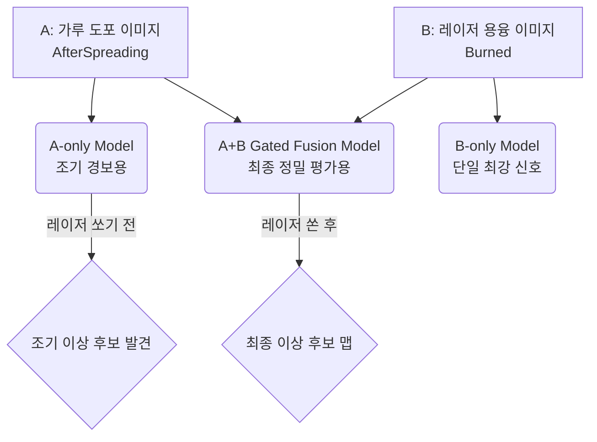
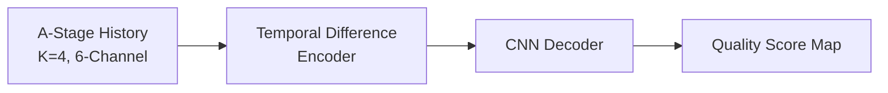
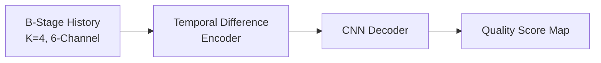
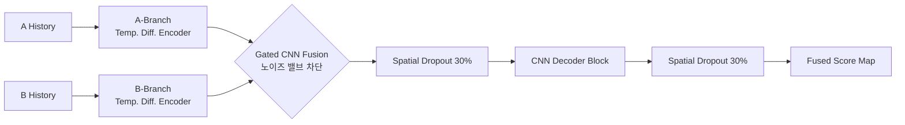

# AMMT 공정 이상 탐지 모델 아키텍처

AMMT 프로젝트에서는 용도와 시점에 따라 3가지의 주요 딥러닝 모델 아키텍처를 진화시켜 왔습니다. 각 모델의 목적과 내부 구조를 아래에 시각화하여 설명합니다.

---

## 1. 프로젝트 전체 구조 (Overall Pipeline)

전체 파이프라인은 시점에 따라 **조기 경보(Early Warning)**와 **사후 종합 평가(Post-Laser Evaluation)**로 나뉩니다.

---

## 2. 개별 모델 아키텍처 상세

### ① A-only Temporal Difference Model
* **목적:** 레이저를 쏘기 전, 가루(Powder)가 덮인 상태만 보고 이상을 예측하는 '조기 경보(Early Warning)' 모델입니다.
* **구조적 특징:** 가루 표면은 극적인 변화가 없기 때문에, 이전 레이어와 현재 레이어의 미세한 '차이(Difference)'에만 집중하도록 시계열 차분 인코더를 사용합니다.

### ② B-only Temporal Difference Model
* **목적:** 레이저를 쏜 직후의 쇳물(Melt pool)과 스패터(Spatter) 열화상을 분석하는 모델입니다.
* **구조적 특징:** 결함에 대한 가장 강력하고 직접적인 신호(다크 스팟 등)를 담고 있으며, 단일 모델 중 가장 높은 정확도(Test Loss 0.0546)를 기록한 베이스라인입니다. A-only와 동일한 구조지만 입력 데이터만 B-stage를 사용합니다.

### ③ A+B Gated Fusion Model (v3 최신형)
* **목적:** 가루 상태(A)와 쇳물 상태(B)의 정보를 모두 활용하여 최고의 정확도를 끌어내기 위한 최종 병기입니다.
* **구조적 특징:** 
  1. A와 B를 독립적인 인코더로 각각 처리합니다.
  2. 단순 병합 시 발생하는 **노이즈 간섭**을 막기 위해, **Gated CNN** 모듈이 A와 B의 특징을 분석하여 "어떤 채널/공간의 정보를 살리고 죽일지(Attention)" 스스로 밸브를 조절합니다.
  3. 강력한 표현력으로 인한 **과적합(Overfitting)**을 막기 위해, 디코더에 **Spatial Dropout (30%)**을 적용하여 정보의 일부를 랜덤하게 차단합니다.

---

## 3. 핵심 하이퍼파라미터 설정 및 설계 의도

단순히 파라미터 값(숫자)을 나열하는 데 그치지 않고, 실제 공정 데이터가 가진 한계(노이즈, 불균형, 오차)를 극복하기 위해 아래와 같이 하이퍼파라미터를 통제했습니다.

### 📊 모델별 하이퍼파라미터 설정표

| 파라미터(Parameter) | A-only (조기경보) | B-only (단일최강) | A+B Fusion (v6 실무용) | A+B Fusion (v7 튜닝용) |
| :--- | :---: | :---: | :---: | :---: |
| **Epochs** | 24 | 24 | **8 (Early Stopping)** | 30 |
| **Learning Rate** | 3e-4 | 3e-4 | 3e-4 | 1e-4 |
| **Weight Decay** | 0.01 | 0.01 | 0.01 | 0.05 |
| **Spatial Dropout** | 0.0 | 0.0 | 30% | 30% |
| **Temporal History (K)** | 4 | 4 | 4 | 4 |
| **Target Sigma** | 2 | 2 | 2 | 2 |
| **Binarization Threshold** | 0.85 | 0.85 | 0.85 | 0.85 |

---

### 💡 핵심 파라미터 설계 의도 (왜 이렇게 설정했는가?)

#### 1. 시계열 길이 (Temporal History, K=4)
- **현상:** 결함은 한 층(Layer)의 실수뿐 아니라 여러 층에 걸친 열 누적으로 서서히 발생하기도 합니다.
- **해결:** 과거 4개 레이어 이미지를 묶어(6-Channel) 모델이 열적/구조적 변화의 **추세(Trend)**를 인지하도록 설계했습니다.

#### 2. 정규화 및 과적합 방지 (Spatial Dropout & Weight Decay)
- **현상:** 결함 데이터가 극도로 희귀하여, 파라미터가 거대한 Fusion 모델은 특정 결함 픽셀 위치를 그대로 '암기'해버리는 과적합(Overfitting)이 쉽게 발생합니다.
- **해결:** 
  - 피처 맵 채널 전체를 30%씩 무작위로 끄는 **Spatial Dropout** 적용.
  - 가중치 크기를 억제하는 강력한 **Weight Decay** 적용으로 특정 노이즈에 대한 의존을 차단.

> **🔍 분석 심화: 최저점 Loss를 찍은 30-Epoch가 아닌 8-Epoch 모델을 최종 선택한 이유**  
> 위 표를 보면 30-Epoch(v7) 튜닝 모델이 14 에포크 부근에서 검증 손실(Validation Loss) 0.09까지 떨어집니다. 하지만 직전/직후에 0.48~0.57로 극심하게 요동(Oscillation)을 칩니다.  
> 
> 가장 Loss가 낮았던 14 에포크 모델을 미지의 **Test Set**에 돌려본 결과, **8-Epoch 모델은 Test Loss 3.4로 선방한 반면 30-Epoch 모델은 6.4로 성능이 완전히 붕괴**되었습니다.  
> 즉, 0.09는 진짜 실력이 아닌 우연히 검증 셋 노이즈에 맞아떨어진 **거짓된 과적합(Lucky Cherry-picking)**이었으며, 미지의 데이터에 대해 가장 튼튼한 일반화(Generalization) 성능을 보인 8-Epoch 모델을 실무용으로 채택했습니다.

#### 3. 가우시안 타겟 릴렉세이션 (Gaussian Target Sigma=2)
- **현상:** 사후 XCT 정답지를 2D 카메라 좌표계로 투영할 때 1~2 픽셀의 기계적 오차(Calibration Drift)가 필연적으로 발생합니다.
- **해결:** 정답 픽셀에 반경 2-Pixel의 **가우시안 블러**를 적용하여 기계적 오차를 유연하게 수용(관용)했습니다. 칼채점을 하지 않음으로써 실제 현장 결함 검출력(Recall)이 폭발적으로 상승했습니다.

#### 4. 결함 임계값 (Binarization Threshold=0.85)
- **현상:** 애매한 회색 지대(Grey Area) 점수를 정답지로 주면 모델의 결정 경계가 흐려집니다.
- **해결:** 스캔 점수 상위 15% 이상만 결함(1)으로 취급하는 극단값 타겟팅을 통해, 스패터 폭발이나 파우더 뭉침 같은 **확실한 시각적 특징만 학습**하도록 유도했습니다.
