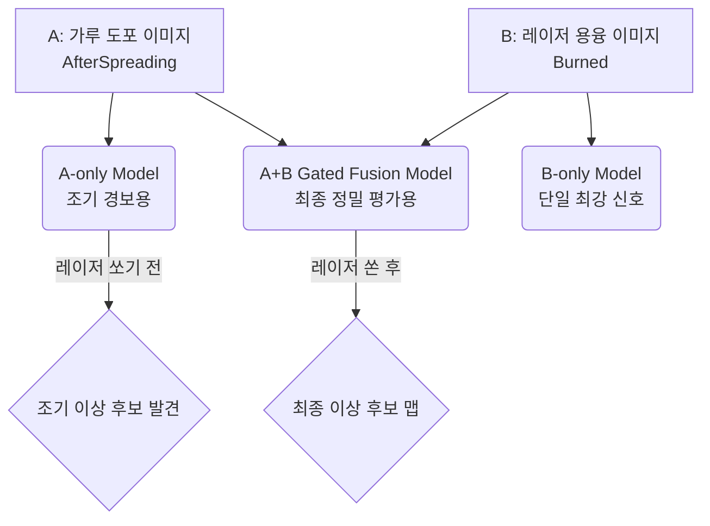
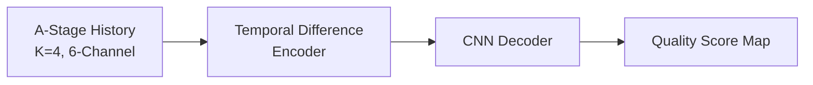
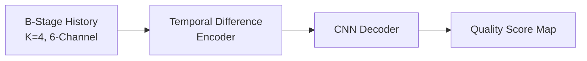
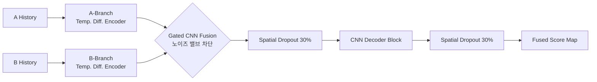

# AMMT 공정 이상 탐지 모델 아키텍처

AMMT 프로젝트에서는 용도와 시점에 따라 3가지의 주요 딥러닝 모델 아키텍처를 진화시켜 왔습니다. 각 모델의 목적과 내부 구조를 아래에 시각화하여 설명합니다.

---

## 1. 프로젝트 전체 구조 (Overall Pipeline)

전체 파이프라인은 시점에 따라 **조기 경보(Early Warning)**와 **사후 종합 평가(Post-Laser Evaluation)**로 나뉩니다.

---

## 2. 개별 모델 아키텍처 상세

### ① A-only Temporal Difference Model
* **목적:** 레이저를 쏘기 전, 가루(Powder)가 덮인 상태만 보고 이상을 예측하는 '조기 경보(Early Warning)' 모델입니다.
* **구조적 특징:** 가루 표면은 극적인 변화가 없기 때문에, 이전 레이어와 현재 레이어의 미세한 '차이(Difference)'에만 집중하도록 시계열 차분 인코더를 사용합니다.

### ② B-only Temporal Difference Model
* **목적:** 레이저를 쏜 직후의 쇳물(Melt pool)과 스패터(Spatter) 열화상을 분석하는 모델입니다.
* **구조적 특징:** 결함에 대한 가장 강력하고 직접적인 신호(다크 스팟 등)를 담고 있으며, 단일 모델 중 가장 높은 정확도(Test Loss 0.0546)를 기록한 베이스라인입니다. A-only와 동일한 구조지만 입력 데이터만 B-stage를 사용합니다.

### ③ A+B Gated Fusion Model (v3 최신형)
* **목적:** 가루 상태(A)와 쇳물 상태(B)의 정보를 모두 활용하여 최고의 정확도를 끌어내기 위한 최종 병기입니다.
* **구조적 특징:** 
  1. A와 B를 독립적인 인코더로 각각 처리합니다.
  2. 단순 병합 시 발생하는 **노이즈 간섭**을 막기 위해, **Gated CNN** 모듈이 A와 B의 특징을 분석하여 "어떤 채널/공간의 정보를 살리고 죽일지(Attention)" 스스로 밸브를 조절합니다.
  3. 강력한 표현력으로 인한 **과적합(Overfitting)**을 막기 위해, 디코더에 **Spatial Dropout (30%)**을 적용하여 정보의 일부를 랜덤하게 차단합니다.

---

## 3. 핵심 하이퍼파라미터(Hyperparameter) 설계 의도

단순히 모델을 쌓아 올리는 것을 넘어, 실제 공정 데이터가 가진 한계(노이즈, 불균형, 오차)를 극복하기 위해 아래와 같이 하이퍼파라미터를 통제했습니다.

1. **시계열 길이 (Temporal History, K=4)**
   - **설정값:** 과거 4개 레이어의 이미지를 누적하여 입력(6-Channel)
   - **의도:** 금속 3D 프린팅에서 결함은 단 한 층(Layer)의 실수로 발생하기도 하지만, 여러 층에 걸쳐 열이 누적되면서 서서히 발생하기도 합니다. `K=4`는 메모리 효율성을 유지하면서도 열적/구조적 변화의 '추세(Trend)'를 모델이 인지할 수 있도록 하는 최적의 시계열 길이입니다.

2. **정규화 및 과적합 방지 (Spatial Dropout=0.3, Weight Decay=0.01)**
   - **설정값:** 공간 드롭아웃 30%, AdamW 옵티마이저의 Weight Decay 0.01
   - **의도:** Fusion 모델은 A와 B의 특징을 모두 뽑아내는 거대한 파라미터를 갖습니다. 하지만 불량(Defect) 데이터는 매우 희귀하기 때문에, 모델이 소수의 불량 픽셀 위치를 그대로 '암기'해버리는 과적합(Overfitting) 현상이 쉽게 발생합니다. 이를 막기 위해 일반 Dropout이 아닌 **Spatial Dropout**을 써서 피처 맵의 전체 채널을 통째로 30%씩 무작위로 끄고, 강력한 **가중치 감쇠(Weight Decay)**를 적용하여 모델이 특정 노이즈에 과도하게 의존하지 못하도록 제약을 걸었습니다.

3. **가우시안 타겟 릴렉세이션 (Gaussian Target Sigma=2)**
   - **설정값:** 사후 XCT 정답지를 2D로 투영할 때 반경 2-Pixel의 가우시안 블러 적용
   - **의도:** 캘리브레이션 맵핑 과정에서 필연적으로 발생하는 1~2 픽셀 수준의 기계적 좌표 오차(Calibration Drift)를 모델이 유연하게 받아들이도록 공간적 관용을 베푼 것입니다. 칼채점을 하지 않음으로써 모델의 학습 수렴 속도와 실제 현장 검출력(Recall)이 극적으로 상승했습니다.

4. **결함 임계값 (Binarization Threshold=0.85)**
   - **설정값:** 연속적인 XCT 스캔 점수(Robust Scaled) 중 상위 15% 이상만 결함(1)으로 취급
   - **의도:** 애매한 중간 점수(Grey Area)들을 정답지로 주면 모델의 결정 경계가 흐려집니다. 가장 치명적이고 확실한 상위 15% 극단값만을 타겟으로 설정하여 모델이 명확한 시각적 특징(스패터 폭발, 파우더 뭉침 등)만을 학습하도록 유도했습니다.
